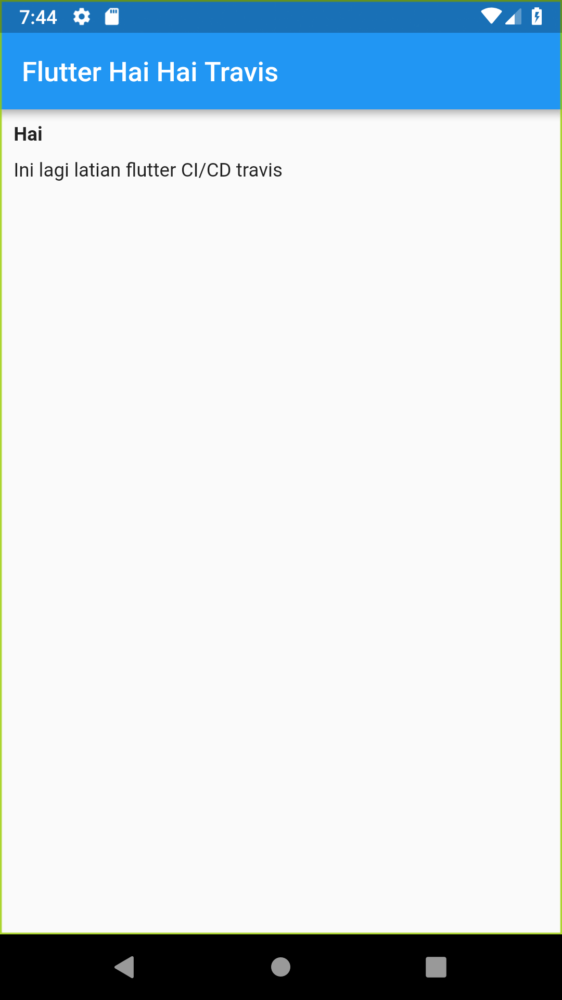

# Flutter Hello Travis 

Flutter hellow world auto CI/CD using Travis



## How To

1. Aktifkan CI/CD pada repo di travis-ci.org
2. Buat file .travis.yml pada root project, isinya sesuaikan dengan repo ini
3. Tambahkan enviroment variable pada setting project di travis-ci.org, yaitu:

  ```text
  github_token => token dari akun github development
  user_name    => username github
  user_email   => password github
  ```

3. Lakukan git add . && git commit
4. Tambahkan versi tag untuk repo

  ```text
  git tag v1.0.0-beta
  ```
  
5. Lakukan push with tag

```text
git push origin master v1.0.0-beta
```

## Output

- [x] Build Android
- [ ] Build IOS